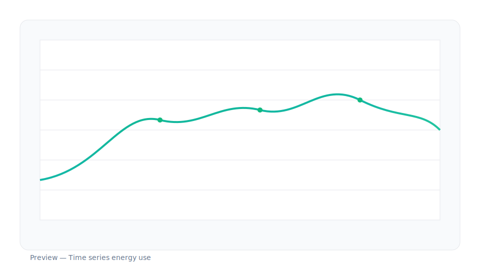

# Energy Analysis Viz

<div align="center">


**Transform CSV energy data into interactive dashboards with AI-powered insights**

[Features](#features) • [Installation](#installation) • [Usage](#usage-guide) • [API](#api-endpoints) • [Deployment](#deployment-instructions)

</div>

---

## Table of Contents

- [Description](#-description--overview)
- [Features](#-features)
- [Tech Stack](#-tech-stack)
- [Installation](#-installation)
- [Usage Guide](#-usage-guide)
- [Project Structure](#-project-structure)
- [Configuration](#-configuration)
- [Scripts / Commands](#-scripts--commands)
- [Screenshots](#-screenshots)
- [API Endpoints](#-api-endpoints)
- [Deployment](#-deployment-instructions)
- [Troubleshooting](#-troubleshooting)
- [Contributing](#-contributing)
- [License](#-license)
- [Contact](#-contact--author-info)

---

## Description / Overview

**Energy Analysis Viz** is a modern web application designed to transform CSV energy simulation data into interactive, visually compelling dashboards. Built with React and TypeScript, it provides a seamless workflow for uploading, parsing, and visualizing energy consumption data with an integrated AI chatbot assistant for intelligent data interpretation.

The application supports multiple energy modeling formats (IESVE, OpenStudio, eQUEST) and generates comprehensive visualizations including annual comparisons, category breakdowns, and monthly trend analysis. The AI-powered chatbot helps users understand their data, interpret charts, and discover insights.

### Key Highlights

- **Fast & Modern**: Built with Vite for lightning-fast development and builds
- **Interactive Visualizations**: Multiple chart types powered by D3.js and Recharts
- **AI Assistant**: Integrated chatbot for data interpretation and guidance
- **Responsive Design**: Beautiful UI built with Tailwind CSS
- **Type-Safe**: Full TypeScript implementation for reliability
- **Export Capabilities**: Generate PDF reports from your dashboards

---

## Features

### Core Functionality

- **CSV Upload & Parsing**
  - Drag-and-drop file upload interface
  - Support for multiple energy modeling formats (IESVE, OpenStudio, eQUEST)
  - Automatic header detection and data normalization
  - Real-time data preview before processing

- **Interactive Dashboard**
  - **Annual Comparison Charts**: Side-by-side visualization of current vs. future energy scenarios
  - **Category Breakdown**: Pie charts showing energy consumption by category
  - **Monthly Trends**: Line charts displaying time-series data for selected categories
  - **Project Information**: Comprehensive metadata display and management
  - **Data Insights**: AI-generated insights and recommendations

- **AI Chatbot Assistant**
  - Floating chat interface accessible from the dashboard
  - Contextual help for dashboard navigation
  - Chart interpretation guidance
  - Trend analysis suggestions
  - Anomaly detection tips

- **Export & Reporting**
  - PDF generation from dashboard views
  - Chart export capabilities
  - Data summary reports

### User Experience

- Clean, intuitive interface with smooth animations
- Responsive design for desktop and tablet devices
- Real-time data validation and error handling
- Session-based data persistence
- Quick navigation between upload, dashboard, and home pages

---

## Tech Stack

### Frontend

| Technology | Version | Purpose |
|------------|---------|---------|
| **React** | 18.3.1 | UI framework |
| **TypeScript** | 5.9.3 | Type safety |
| **Vite** | 5.4.8 | Build tool & dev server |
| **Tailwind CSS** | 3.4.12 | Styling |
| **React Router** | 6.26.2 | Client-side routing |
| **D3.js** | 7.9.0 | Data visualization |
| **Recharts** | 2.13.0 | Chart components |
| **PapaParse** | 5.4.1 | CSV parsing |
| **jsPDF** | 3.0.3 | PDF generation |
| **html2canvas** | 1.4.1 | Canvas rendering |
| **Zod** | 3.23.8 | Schema validation |

### Backend

| Technology | Version | Purpose |
|------------|---------|---------|
| **Node.js** | - | Runtime environment |
| **Express** | 4.18.2 | Web framework |
| **TypeScript** | 5.9.3 | Type safety |
| **tsx** | 4.7.0 | TypeScript execution |
| **OpenAI API** | 4.20.1 | AI chatbot integration |
| **CORS** | 2.8.5 | Cross-origin resource sharing |
| **dotenv** | 16.3.1 | Environment variable management |

### Development Tools

- **Concurrently**: Run multiple npm scripts simultaneously
- **PostCSS & Autoprefixer**: CSS processing
- **ESLint** (if configured): Code linting

---

## Installation

### Prerequisites

- **Node.js** (v18 or higher recommended)
- **npm** (v9 or higher) or **yarn**
- **OpenAI API Key** (for chatbot functionality)

### Step-by-Step Setup

#### 1. Clone the Repository

```bash
git clone <repository-url>
cd energy-viz
```

#### 2. Install Frontend Dependencies

```bash
npm install
```

#### 3. Install Backend Dependencies

```bash
cd server
npm install
cd ..
```

#### 4. Configure Environment Variables

**Frontend Configuration** (`.env` in root directory):

Create a `.env` file in the project root:

```env
VITE_API_BASE_URL=http://localhost:5000
```

**Backend Configuration** (`server/.env`):

Create a `.env` file in the `server` directory:

```env
# OpenAI API Configuration
OPENAI_API_KEY=your_openai_api_key_here
OPENAI_MODEL=gpt-4o-mini

# Server Configuration
PORT=5000
CLIENT_ORIGIN=http://localhost:5173
```

> **Important**: Replace `your_openai_api_key_here` with your actual OpenAI API key. You can obtain one from [OpenAI's Platform](https://platform.openai.com/api-keys).

#### 5. Verify Installation

Check that all dependencies are installed correctly:

```bash
# Frontend
npm list --depth=0

# Backend
cd server && npm list --depth=0 && cd ..
```

---

## Usage Guide

### Starting the Application

#### Option 1: Run Both Frontend and Backend Together (Recommended)

```bash
npm run dev:all
```

This command starts:
- **Frontend** on `http://localhost:5173`
- **Backend** on `http://localhost:5000`

#### Option 2: Run Services Separately

**Start Frontend:**
```bash
npm run dev:client
# or
npm run dev
```

**Start Backend:**
```bash
npm run dev:server
```

### Using the Application

#### 1. **Welcome Page**
   - Navigate to the home page to learn about the application
   - Click "Get Started" or navigate to the Upload page

#### 2. **Upload CSV Data**
   - Go to the Upload page (`/upload`)
   - Select your energy modeling format (IESVE, OpenStudio, or eQUEST)
   - Upload your CSV file(s):
     - **Current Scenario**: Required
     - **Future Scenario**: Optional (for comparison)
   - Fill in project metadata (name, square footage, location, etc.)
   - Click "Process and View Dashboard"

#### 3. **Explore the Dashboard**
   - View annual energy consumption comparisons
   - Switch between Current and Future scenarios
   - Select categories to view monthly trends
   - Review AI-generated insights
   - Export charts as PDF

#### 4. **Interact with the Chatbot**
   - Click the floating chat button (bottom-right corner)
   - Ask questions about:
     - How to interpret charts
     - Understanding trends in your data
     - Comparing energy categories
     - Identifying anomalies
   - The chatbot provides contextual, helpful responses

### Example Questions for the Chatbot

- "What is the largest energy consumption category?"
- "How do I interpret a line chart?"
- "What should I look for in monthly trends?"
- "How can I compare current vs future scenarios?"
- "What are common anomalies in energy data?"

---

## Project Structure

```
energy-viz/
│
├── public/                 # Static assets
│   └── images/            # Image files
│
├── server/                # Backend Express server
│   ├── routes/            # API route handlers
│   │   └── chat.ts       # Chat endpoint
│   ├── utils/            # Utility functions
│   │   └── openaiClient.ts  # OpenAI integration
│   ├── index.ts          # Server entry point
│   ├── package.json      # Server dependencies
│   └── tsconfig.json     # TypeScript config
│
├── src/                   # Frontend source code
│   ├── components/       # React components
│   │   ├── Chatbot.tsx   # AI chatbot component
│   │   ├── EnergyChart.tsx      # Chart component
│   │   └── EnergyDashboard.tsx  # Main dashboard
│   │
│   ├── lib/              # Library code
│   │   └── parsers/      # CSV parsing utilities
│   │       └── index.ts
│   │
│   ├── pages/            # Page components
│   │   ├── App.tsx      # Welcome/home page
│   │   ├── Dashboard.tsx # Dashboard page
│   │   └── Upload.tsx   # File upload page
│   │
│   ├── index.css        # Global styles
│   └── main.tsx         # Application entry point
│
├── .env                  # Frontend environment variables
├── index.html           # HTML template
├── package.json         # Frontend dependencies & scripts
├── vite.config.ts       # Vite configuration
├── tailwind.config.js   # Tailwind CSS configuration
├── tsconfig.json        # TypeScript configuration
└── README.md           # This file
```

### Key Files Explained

- **`src/main.tsx`**: Application entry point, sets up React Router
- **`src/pages/Dashboard.tsx`**: Main dashboard page with chatbot integration
- **`src/components/EnergyDashboard.tsx`**: Core dashboard logic and visualizations
- **`src/components/Chatbot.tsx`**: Floating chatbot UI component
- **`server/index.ts`**: Express server setup and middleware
- **`server/routes/chat.ts`**: Chat API endpoint handler
- **`server/utils/openaiClient.ts`**: OpenAI API client wrapper

---

## Configuration

### Environment Variables

#### Frontend (`.env`)

| Variable | Description | Default |
|----------|-------------|---------|
| `VITE_API_BASE_URL` | Backend API base URL | `http://localhost:5000` |

#### Backend (`server/.env`)

| Variable | Description | Default |
|----------|-------------|---------|
| `OPENAI_API_KEY` | Your OpenAI API key | **Required** |
| `OPENAI_MODEL` | OpenAI model to use | `gpt-4o-mini` |
| `PORT` | Server port | `5000` |
| `CLIENT_ORIGIN` | Allowed CORS origin | `http://localhost:5173` |

### Tailwind CSS Configuration

The project uses Tailwind CSS with a custom configuration. Modify `tailwind.config.js` to customize:

- Color schemes
- Font families
- Breakpoints
- Custom utilities

### Vite Configuration

The `vite.config.ts` file configures:

- React plugin
- Build options
- Development server settings

Modify as needed for your deployment requirements.

---

## Scripts / Commands

### Root Directory Scripts

| Command | Description |
|---------|-------------|
| `npm run dev` | Start Vite dev server (frontend only) |
| `npm run dev:client` | Alias for `npm run dev` |
| `npm run dev:server` | Start Express server (backend only) |
| `npm run dev:all` | Start both frontend and backend concurrently |
| `npm run build` | Build frontend for production |
| `npm run preview` | Preview production build locally |

### Server Directory Scripts

| Command | Description |
|---------|-------------|
| `npm run dev` | Start server with hot reload (tsx watch) |
| `npm start` | Start server in production mode (tsx) |

### Example Workflow

```bash
# Development (both services)
npm run dev:all

# Production build
npm run build
npm run preview

# Backend only (for testing)
cd server
npm run dev
```

---

## Screenshots

> **Note**: Add screenshots or GIFs of your application here. Consider including:
> - Welcome/Home page
> - Upload interface
> - Dashboard with charts
> - Chatbot interaction
> - Mobile responsive views

### Dashboard View

*Main dashboard showing energy consumption visualizations*

### Chatbot Interface
*Floating chatbot providing AI-powered assistance*

### Upload Page
*CSV upload interface with format selection*

---

## API Endpoints

### Base URL

- **Development**: `http://localhost:5000`
- **Production**: Configure via `VITE_API_BASE_URL`

### Endpoints

#### `GET /health`

Health check endpoint.

**Response:**
```json
{
  "status": "ok"
}
```

#### `POST /api/chat`

Send a message to the AI chatbot.

**Request Body:**
```json
{
  "message": "What is the largest energy consumption category?"
}
```

**Response:**
```json
{
  "reply": "Based on typical energy dashboards, the largest consumption category is usually Space Heating or Space Cooling, depending on your climate zone. To identify the largest category in your specific dashboard, look at the pie chart or annual comparison chart..."
}
```

**Error Response:**
```json
{
  "error": "Failed to process chat message",
  "reply": "I apologize, but I encountered an error. Please try again later."
}
```

**Status Codes:**
- `200`: Success
- `400`: Bad request (missing or invalid message)
- `500`: Server error

---

## Deployment Instructions

### Frontend Deployment (Vercel, Netlify, etc.)

1. **Build the application:**
   ```bash
   npm run build
   ```

2. **Configure environment variables:**
   - Set `VITE_API_BASE_URL` to your production backend URL

3. **Deploy the `dist` folder:**
   - The build output is in the `dist` directory
   - Upload to your hosting provider

#### Vercel Example

```bash
npm install -g vercel
vercel
```

#### Netlify Example

```bash
npm install -g netlify-cli
netlify deploy --prod --dir=dist
```

### Backend Deployment (Railway, Render, Heroku, etc.)

1. **Set environment variables:**
   - `OPENAI_API_KEY`
   - `OPENAI_MODEL` (optional)
   - `PORT` (usually auto-set by platform)
   - `CLIENT_ORIGIN` (your frontend URL)

2. **Deploy the server directory:**
   - Most platforms auto-detect Node.js
   - Ensure the start script is: `cd server && npm start`

#### Railway Example

1. Connect your repository
2. Set root directory to `server`
3. Add environment variables
4. Deploy

#### Render Example

1. Create a new Web Service
2. Set build command: `cd server && npm install`
3. Set start command: `npm start`
4. Add environment variables

### Docker Deployment (Optional)

Create a `Dockerfile` in the root:

```dockerfile
# Frontend
FROM node:18-alpine AS frontend
WORKDIR /app
COPY package*.json ./
RUN npm install
COPY . .
RUN npm run build

# Backend
FROM node:18-alpine
WORKDIR /app
COPY server/package*.json ./server/
RUN cd server && npm install
COPY server ./server
COPY --from=frontend /app/dist ./public
EXPOSE 5000
CMD ["node", "server/index.js"]
```

### Production Checklist

- [ ] Set `VITE_API_BASE_URL` to production backend URL
- [ ] Configure CORS in backend for production frontend domain
- [ ] Set secure `OPENAI_API_KEY` in backend environment
- [ ] Enable HTTPS for both frontend and backend
- [ ] Configure error logging and monitoring
- [ ] Set up rate limiting for API endpoints
- [ ] Test chatbot functionality with production API key

---

## Troubleshooting

### Common Issues

#### Backend Server Not Starting

**Problem**: Server fails to start or crashes immediately.

**Solutions**:
- Verify Node.js version: `node --version` (should be 18+)
- Check if port 5000 is already in use:
  ```bash
  # Windows
  netstat -ano | findstr :5000
  
  # Mac/Linux
  lsof -i :5000
  ```
- Ensure all dependencies are installed: `cd server && npm install`
- Check for TypeScript errors: `cd server && npx tsc --noEmit`

#### Chatbot Not Responding

**Problem**: Chatbot shows error messages or doesn't respond.

**Solutions**:
- Verify `OPENAI_API_KEY` is set correctly in `server/.env`
- Check that the backend server is running on port 5000
- Verify `VITE_API_BASE_URL` matches your backend URL
- Check browser console for CORS errors
- Test the API directly:
  ```bash
  curl -X POST http://localhost:5000/api/chat \
    -H "Content-Type: application/json" \
    -d '{"message":"test"}'
  ```

#### CSV Upload Fails

**Problem**: CSV file upload doesn't work or data isn't parsed correctly.

**Solutions**:
- Verify CSV format matches expected structure
- Check browser console for parsing errors
- Ensure file is valid CSV (comma-separated)
- Try a different CSV file to isolate the issue

#### Build Errors

**Problem**: `npm run build` fails with TypeScript or other errors.

**Solutions**:
- Run type checking: `npx tsc --noEmit`
- Clear node_modules and reinstall: `rm -rf node_modules && npm install`
- Check for missing dependencies
- Verify all environment variables are set

#### CORS Errors

**Problem**: Browser shows CORS errors when calling the API.

**Solutions**:
- Verify `CLIENT_ORIGIN` in `server/.env` matches your frontend URL
- Check that CORS middleware is properly configured
- Ensure backend is running before frontend makes requests

### Getting Help

If you encounter issues not covered here:

1. Check the browser console for error messages
2. Review server logs for backend errors
3. Verify all environment variables are set correctly
4. Ensure all dependencies are installed
5. Check that both frontend and backend are running

---

## Contributing

We welcome contributions! Please follow these guidelines:

### How to Contribute

1. **Fork the repository**
2. **Create a feature branch:**
   ```bash
   git checkout -b feature/your-feature-name
   ```
3. **Make your changes:**
   - Follow the existing code style
   - Add TypeScript types where needed
   - Write clear commit messages
4. **Test your changes:**
   - Test locally with `npm run dev:all`
   - Verify no TypeScript errors
   - Test the chatbot functionality
5. **Submit a pull request:**
   - Provide a clear description of changes
   - Reference any related issues

### Code Style Guidelines

- Use TypeScript for all new code
- Follow React best practices (hooks, functional components)
- Use Tailwind CSS for styling (avoid custom CSS when possible)
- Maintain consistent naming conventions
- Add comments for complex logic

### Reporting Bugs

When reporting bugs, please include:

- Steps to reproduce
- Expected behavior
- Actual behavior
- Browser and OS information
- Error messages (if any)

---

## License

This project is licensed under the MIT License - see the [LICENSE](LICENSE) file for details.

```
MIT License

Copyright (c) 2024 Energy Analysis Viz

Permission is hereby granted, free of charge, to any person obtaining a copy
of this software and associated documentation files (the "Software"), to deal
in the Software without restriction, including without limitation the rights
to use, copy, modify, merge, publish, distribute, sublicense, and/or sell
copies of the Software, and to permit persons to whom the Software is
furnished to do so, subject to the following conditions:

The above copyright notice and this permission notice shall be included in all
copies or substantial portions of the Software.

THE SOFTWARE IS PROVIDED "AS IS", WITHOUT WARRANTY OF ANY KIND, EXPRESS OR
IMPLIED, INCLUDING BUT NOT LIMITED TO THE WARRANTIES OF MERCHANTABILITY,
FITNESS FOR A PARTICULAR PURPOSE AND NONINFRINGEMENT. IN NO EVENT SHALL THE
AUTHORS OR COPYRIGHT HOLDERS BE LIABLE FOR ANY CLAIM, DAMAGES OR OTHER
LIABILITY, WHETHER IN AN ACTION OF CONTRACT, TORT OR OTHERWISE, ARISING FROM,
OUT OF OR IN CONNECTION WITH THE SOFTWARE OR THE USE OR OTHER DEALINGS IN THE
SOFTWARE.
```

---

## Contact / Author Info

### Project Maintainer

**Your Name**  
*Your Title/Role*

- Email: [your.email@example.com](mailto:your.email@example.com)
- LinkedIn: [Your LinkedIn Profile](https://linkedin.com/in/yourprofile)
- GitHub: [@yourusername](https://github.com/yourusername)
- Website: [yourwebsite.com](https://yourwebsite.com)

### Acknowledgments

- Built with [React](https://react.dev/)
- Powered by [OpenAI](https://openai.com/) for AI capabilities
- Visualizations with [D3.js](https://d3js.org/) and [Recharts](https://recharts.org/)
- Styled with [Tailwind CSS](https://tailwindcss.com/)

### Support

For questions, issues, or feature requests:

- [Open an Issue](https://github.com/yourusername/energy-viz/issues)
- [Start a Discussion](https://github.com/yourusername/energy-viz/discussions)
- Email: [your.email@example.com](mailto:your.email@example.com)

---

<div align="center">

**Made with care for energy analysis and visualization**

Star this repo if you find it helpful!

</div>
